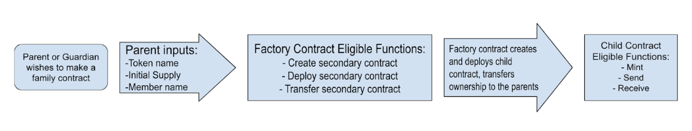

# FamCash – Safe crypto for families.

## Overview
The objective of this project is to use Ethereum smart contracts to onboard family units into the crypto space by allowing them to easily create their own private tokens for use only amongst themselves.

## How It Works

We begin with the family contract. This contract is owned by a parent and allows them to mint a private  token. They provide their wallet address, a token name, and a token ticker symbol. Then, they pay the gas fee to mint their tokens and receive them in their wallet. From there, they can add new family members by using the addParent or addMember options and disperse tokens to them at their leisure. The difference between parents and members is that parents can mint new tokens while members cannot. This is by design so parents can restrict their young ones from minting tokens.

Next, there's the FamCash Factory contract, which simply takes the wallet address, token name, and token ticker provided by parents and creates their new FamCash contracts.

## FamCash Contract Properties
- contractOwner - The wallet address of the parent creating the contract.
- tokenName - The name of the token set by the contract owner.
- tokenTicker - The ticker symbol of the token set by the contract owner.

## FamCash Contract Functions
- mint - Creates tokens (Restricted to parents)
- send - Begins sending process
- addParent - Adds a wallet address and grants it Minter & Member roles.
- addMember - Adds a wallet address and grants it Member role.

## FamCash Factory Contract Functions
- NewFamCash - Creates an empty array to store all contracts. Creates a new FamCash contract by taking in user-specified values to set as contractOwner, tokenName, and tokenTicker. Then, adds each new contract to the empty array.

---

Built with 💜 using [RemixIDE](https://remix.ethereum.org/#lang=en&optimize=false&runs=200&evmVersion=null&version=soljson-v0.8.18+commit.87f61d96.js)

---
